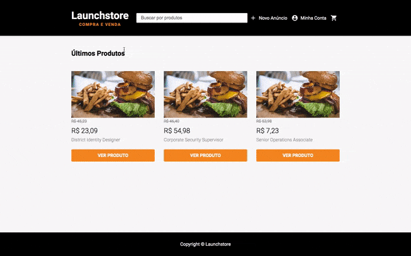
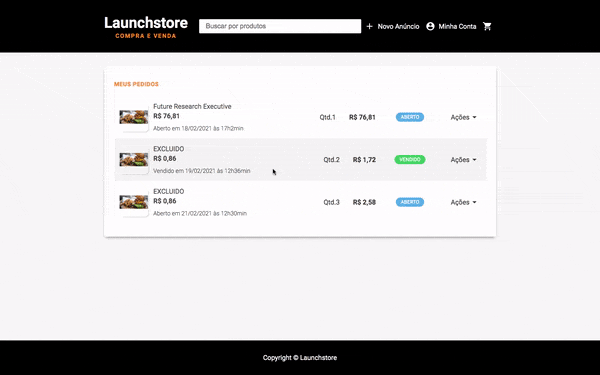

<h1 align="center">
    
    <br />
    
    <br />
    
</h1>

<br />

<p align="center">
  
  
  
  
</p>

<br />

<p align="center">
 <a href="#-sobre-o-projeto">Sobre</a> •
 <a href="#-funcionalidades">Funcionalidades</a> •
 <a href="#-como-executar-o-projeto">Como executar</a> • 
 <a href="#-tecnologias">Tecnologias</a> • 
 <a href="#-Como-contribuir-para-o-projeto">Contribua</a> • 
 <a href="#-autor">Autor</a> • 
 <a href="#user-content--licença">Licença</a>
</p>

<br />

## 💻 Sobre o projeto

🛒🛍️  Launchstore - aplicação web para compra e venda de produtos. Marketplace com gerenciamento de cadastro de anúncios, produtos e usuários.

Projeto realizado durante o **Bootcamp Launchbase** oferecido pela [Rocketseat](https://rocketseat.com.br/).
O Bootcamp foi uma experiência online com muito conteúdo prático e desafios para dominar programação web do zero.

---

## ⚙️ Funcionalidades

-   Sistema de login e recuperação de senha
-   Carrinho de compras
-   Upload de imagens com multer
-   Páginas dinâmicas com Nunjucks
-   Envio de email com Nodemailer
-   Página de busca com especificação de categorias
-   Animações com Lottie
-   Banco de dados PostgresSQL
-   Soft Delete
-   Dropdown Padronizado
-   Validações
-   etc


- [x] **Usuários cadastrados no site podem:**
  - [x] criar seus próprios anúncios para vender seus produtos
  - [x] comprar produtos de outros usuários
  - [x] editar ou excluir seus produtos cadastrados
  - [x] editar seus dados de acesso ao sistema
  - [x] produtos podem ter os seguintes itens: 
    - categoria
    - imagens associadas ao produto
    - título
    - descrição
    - valor
    - quantidade

- [x] **Os usuários cadastrados  também podem:**
  - [x] visualizar seu histórico de pedidos realizados
  - [x] visualizar seu histórico de vendas realizadas
  - [x] alterar status de pedido em aberto para "vendido" ou "cancelado"

- [x] **Site pode ser acessado por qualquer usuário não cadastrado, podendo:**
    - visualizar todos produtos cadastradas no site e seus detalhes
    - para vender ou comprar, deve se cadastrar no site
    - realizar pesquisa de produtos
    - cadastro aberto para qualquer visitante

---

## 🚀 Como executar o projeto

### 💡 Pré-requisitos

Antes de começar, você vai precisar ter instalado em sua máquina as seguintes ferramentas:
[Git](https://git-scm.com), [Node.js](https://nodejs.org/en/), e um editor para trabalhar com o código como [VSCode](https://code.visualstudio.com/).  Além disso, será preciso ter o [Postgres](https://www.postgresql.org/) instalado para criação do banco de dados.

#### 🎲  Rodando o Backend (servidor)

```bash

# Clone este repositório
$ git clone https://github.com/marques-gabriel/launchstore.git

# Instale as dependências
$ npm install

# Conexão com o banco de dados
$ edite o arquivo "db.js" dentro da pasta "src/config" com o user e password Postgres

# Inicie o postgres com o comando abaixo:
$ mac: pg_ctl -D /usr/local/var/postgres start
$ windows: .\pg_ctl.exe -D "C:\Program Files\PostgreSQL\12\data" start (navegar até a pasta de instalação antes de iniciar - Navegue até a pasta bin PostgreSQL) Caso a sua versão instalada seja outra, atente-se ao número da versão na pasta acima. Troque o 12 pela versão relativa ao seu postgres.

# Criar o banco de dados e as tabelas
$ utilize os comandos inclusos no arquivo database.sql 

# Popule o banco de dados usando o arquivo "seed.js"
$ node seed.js

# Criar Novos Usuários e Recupeção de Senha
$ edite o arquivo mailer.js dentro da pasta scr/lib com suas credenciais (mailtrap) para utilizar esse recurso.

# Inicie a aplicação
$ npm start

```
**💡  Não exclua ou altere o arquivo placeholder.png da pasta plublic/images, pois os produtos gerados pelo seed.js compartilham desse arquivo entre si. Caso tenha excluído, ele também está disponíveis na pasta assets.**

**__Crie novos produtos e usuários para testar a aplicação com edição e remoção por exemplo__**

**Senha padrão para acesso de qualquer usuário: _1111_**

**Dica: Use o [Postbird](https://github.com/Paxa/postbird) - PostgreSQL GUI client, para visualizar o conteúdo das tabelas** 💡

---

## 🛠 Tecnologias

As seguintes ferramentas foram usadas na construção do projeto:

-   **[NodeJS](https://nodejs.org/en/)**
-   **[Express](https://expressjs.com/)**
-   **[Express-session](https://github.com/expressjs/session)**
-   **[Nunjucks](https://mozilla.github.io/nunjucks/)**
-   **[Postgresql](https://www.postgresql.org/)**
-   **[Pg](https://www.npmjs.com/package/pg)**
-   **[Connect-pg-simple](https://github.com/voxpelli/node-connect-pg-simple)**
-   **[Multer](https://github.com/expressjs/multer)**
-   **[Nodemailer](https://nodemailer.com/about/)**
-   **[BcryptJS](https://github.com/dcodeIO/bcrypt.js)**
-   **[Faker](https://github.com/Marak/Faker.js)**
-   **[Nodemon](https://www.npmjs.com/package/nodemon)**
-   **[Lottie-web](https://github.com/airbnb/lottie-web)**
-   **[Method-override](https://www.npmjs.com/package/method-override)**
-   **[Npm-run-all](https://www.npmjs.com/package/npm-run-all)**
-   **[browser-sync](https://www.npmjs.com/package/browser-sync)**

> Veja o arquivo  [package.json](https://github.com/marques-gabriel/launchstore/blob/main/package.json)

***

## 💪 Como contribuir para o projeto

1. Faça um **fork** do projeto.
2. Crie uma nova branch com as suas alterações: `git checkout -b my-feature`
3. Salve as alterações e crie uma mensagem de commit contando o que você fez: `git commit -m "feature: My new feature"`
4. Envie as suas alterações: `git push origin my-feature`

---

## 👨🏽‍💻 Autor

<a href="https://github.com/marques-gabriel">
 
 <br />
 <sub><b>Gabriel Marques</b></sub></a> <a href="https://www.linkedin.com/in/marques-gabriel/"">🚀   </a>
 <br />

 [](https://instagram.com/marquesgabriel__) [](https://www.linkedin.com/in/marques-gabriel/) 

---

## 📝 Licença

Este projeto está sob a licença [MIT](./LICENSE).

🖤   Feito por Gabriel Marques  👋🏽   [Entre em contato!](https://www.linkedin.com/in/marques-gabriel/)

---
